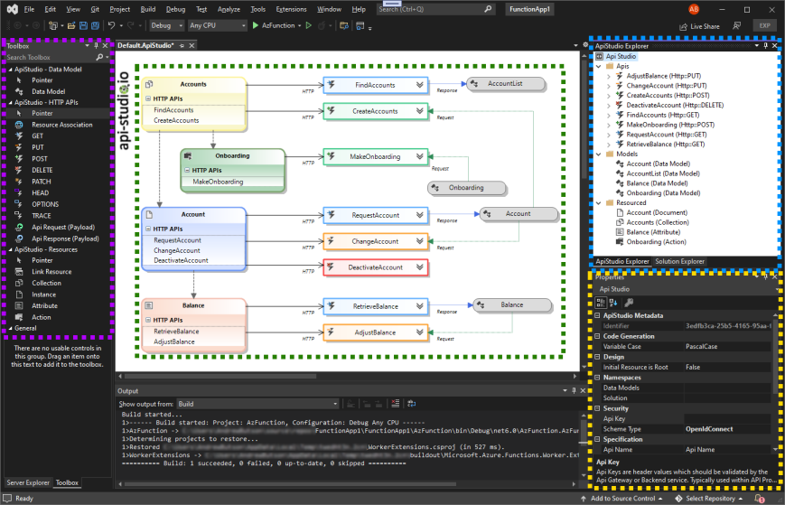
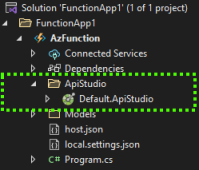
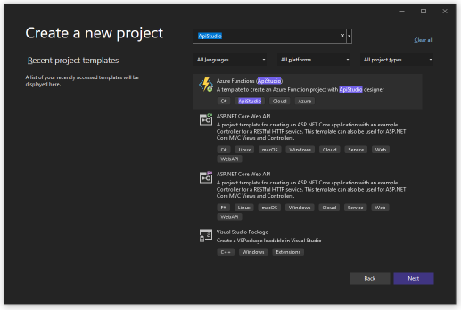

## **What is Api Studio?**
Api Studio is a productivity extension for Microsoft Visual Studio. The extension bridges the role of architect and developer, providing rapid prototyping and promoting industry best practices. Regardless of organisation or project size, Api Studio provides templating to guarantee a consistent look and feel.

## **Visual Studio Extension**

Api Studio Extension enhances Visual Studio 2022 by providing a designer, toolbox, explorer and code generation engine to create and manage Api Studio assets. Promoting An API-first approach means that your APIs are treated as "first-class citizens for any development project." Api Studio provides architects and developers with a solution to quickly design and collaborate, providing the blueprint for solution implementation. In addition, the extension will enable teams to quickly mock solution endpoints, proofing usability before investing in development.

## **How does Api Studio work?**

Api Studio uses a proprietary domain-specific language (DSL), unique visualisation designer and code generation engine to provide an exceptional experience for building modern resource-based solutions.

**Download** [Api Studio Extension for Visual Studio](https://marketplace.visualstudio.com/items?itemName=AndrewButson.ApiStudio) from visual studio marketplace

## **Features**

The extension provides the following features.

- **Designer**: The Visual Studio Api Studio Designer is dedicated to editing Api Studio DSL artefacts used by code generated directly in the Visual Studio environment. To open a .ApiStudio file, the designer opens in the central docking area within visual studio. If there is no such file, you may create it using the Add --> New Item --> ApiStudio.

- **Toolbox**: The Toolbox window displays controls that you can add to Visual Studio projects. Choose View > Toolbox from the menu bar or press Ctrl+Alt+X to open Toolbox. You can drag and drop different controls onto the surface of the Api Studio designer and resize and position the controls. Toolbox appears in conjunction with Api Studio designer views. Toolbox displays only those controls that the current designer can use. You can search within Toolbox to further filter the items that appear.

- **Api Studio Explorer**: You can use the Explorer tool window to create & manage your solutions and projects and to view & interact with your code.

- **Property**: The Visual Studio Properties window is a property browser for Api Studio components. The Properties window list metadata at design time for the currently selected object in any other window in the integrated development environment (IDE).

### **Visual Studio Project**

Api Studio provides a visual studio project containing all assets to get started. The template offers a complete but lightweight solution.

#### Azure Function (dotnet6 - C#)

#### **Template Standards**

Api Studio provides templated standards for header, response codes and security models. Allowing enterprise standards to be shared between development teams. The options are available within visual studios options Tools --> Options --> ApiStudio. The options panel provide Import/Export functionality.

## **Getting Started**
Creating a new project is simple. Visual Studio "Create Project", search "Api Studio" in the project list.

## **What's next**

This extension currently supports RESTful-based APIs. However, we're working on adding support for TypeScript and Python including new protocols including gRpc, WebHooks and WebSocket interfaces.

## **How can I help?**
If you enjoy using the extension, please give it a rating on the [Visual Studio Marketplace](https://marketplace.visualstudio.com/items?itemName=AndrewButson.ApiStudio).

Should you encounter bugs or if you have feature requests, head on over to the [GitHub repo](https://github.com/arbs-io/api-studio-visualstudio) to open an issue if one doesn't already exist.
Pull requests are also very welcome since I can't always get around to fixing all bugs myself. 

This is a personal passion project, so my time is limited.

Another way to help out is to [sponsor me on GitHub](https://github.com/sponsors/arbs-io).

## **Copyright**

Copyright 2021 - 2022 Api Studio, Inc.

Licensed under the MIT License