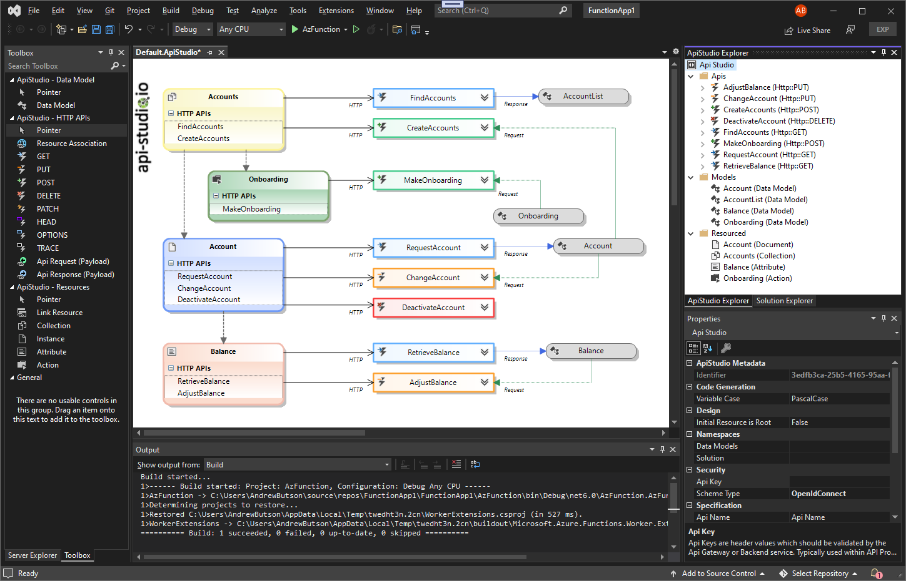
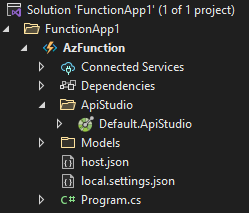

# Api Studio

**Download** this extension from the [VS Marketplace](https://marketplace.visualstudio.com/items?itemName=MadsKristensen.AddNewFile64)

-----------------------------------

This ApiStudio Extension enhances Visual Studio 2022 by making it easy to design and build solutions with synchronous apis. This extension helps bridge the role of architect and developer. Providing a quick method of prototyping using well formed APIs which contains full OpenApi specification. Current support for http, but planned extension for gRpc and asynchronous api ws.

### Features

- **Bespoke Designer**: quickly prototype solution promoting clean resource-based APIs.
- **ApiStudio Project**: Templated project to help get started. Currently Azure Function (dotnet6 - C#)
- **Visual Studio Options**: Set standard header, response codes and security models. Allowing enterprise standards to be shared between development teams.
- **API First**: Architects and Developers can design solutions quickly, providing the blueprint for implementation

### Overview

### Project Structure 

### Getting Started
Creating a new project is simple. Visual Studio "Create Project", search "ApiStudio" in the project list.

### Show the dialog

A new button is added to the context menu in Solution Explorer.

You can either click that button or use the keybord shortcut **Shift+F2**.

### Create folders

Create additional folders for your file by using forward-slash to
specify the structure.

For example, by typing **scripts/test.js** in the dialog, the
folder **scripts** is created if it doesn't exist and the file
**test.js** is then placed into it.

### Custom templates

Create a `.templates` folder at the root of your project.
The templates inside this folder will be used alongside the default ones.

#### Keywords
Inside the template those keywords can be used:
- `{itemname}`: The name of the file without the extension
- `{namespace}`: The namespace

#### Types of template
3 types of template are available:

##### Exact match
When creating the file `Dockerfile`, the extension will look for `dockerfile.txt` template.

##### Convention match or Partial match
If you create a template with the name `repository.txt`, then it will be used when creating a file ending with `Repository` (eg: DataRepository).

##### Extension match
When creating the file `Test.cs`, the extension will look for `.cs.txt` template.

### How can I help?
If you enjoy using the extension, please give it a rating on the [Visual Studio Marketplace][marketplace].

Should you encounter bugs or if you have feature requests, head on over to the [GitHub repo][repo] to open an issue if one doesn't already exist.

Pull requests are also very welcome, since I can't always get around to fixing all bugs myself. This is a personal passion project, so my time is limited.

Another way to help out is to [sponser me on GitHub](https://github.com/sponsors/arbs-io).

## Copyright

Copyright 2021 - 2022 ApiStudio, Inc.

Licensed under the [MIT License](.\src\LICENSE.md)