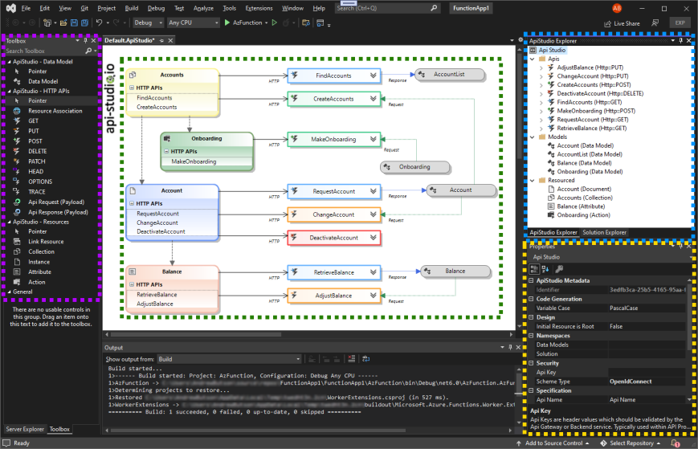

# Api Studio

**Download** this extension from the [VS Marketplace](https://marketplace.visualstudio.com/items?itemName=arbs_io.ApiStudio)

-----------------------------------

This Api Studio Extension enhances Visual Studio 2022 by making designing and building RESTful solutions easy.

Api Studio Designer in Visual Studio provides a rapid development solution for creating resource-based APIs. Api Studio Designer lets you bridge the role of architect and developer, providing quick prototyping solutions and creating well-documented APIs which adhere to industry best practices. In addition, regardless of company or project size, Api Studio provides templating to guarantee your organisation's consistent look and feel. Prototype solution promoting clean resource-based APIs. Architects and developers can use Api Studio Designer and DSL to ensure a consistent standard across solutions. The extension provides a designer, toolbox and explorer to create and manage Api Studio assets.

An API-first approach means that your APIs are treated as "first-class citizens for any development project." Api Studio provides architects and developers with a solution to quickly design and collaborate, providing the blueprint for solution implementation. In addition, the extension will enable teams to quickly mock solution endpoints, proofing usability before investing in development.

## **Features**

The extension provides the following features.

### **Visual Studio Designer**

- **Designer**: The Visual Studio Api Studio Designer is dedicated to editing Api Studio DSL artefacts used by code generated directly in the Visual Studio environment. The Visual Studio designer is available only under the .NET framework, which is supported by all versions of visual studio. Due to technical limitations, we do not yet provide one for .NET Core. To open a .ApiStudio file, the designer opens in the central docking area within visual studio. If there is no such file, you may create it using the Add --> New Item --> ApiStudio.

- **Toolbox**: The Toolbox window displays controls that you can add to Visual Studio projects. Choose View > Toolbox from the menu bar or press Ctrl+Alt+X to open Toolbox. You can drag and drop different controls onto the surface of the Api Studio designer and resize and position the controls. Toolbox appears in conjunction with Api Studio designer views. Toolbox displays only those controls that the current designer can use. You can search within Toolbox to further filter the items that appear.

- **Api Studio Explorer**: You can use the Solution Explorer tool window to create & manage your solutions and projects and to view & interact with your code.

- **Property**: The Visual Studio Properties window is a property browser for Api Studio components. The Properties window list metadata at design-time for the currently selected object in any other window in the integrated development environment (IDE).

### **Visual Studio Project**

templates are available to provide lightweight solution. 
  - 
Api Studio provides help structure for project structure without being too opinionated.

#### Azure Function (dotnet6 - C#)

#### **Template Standards**

Api Studio provides templated standards for header, response codes and security models. Allowing enterprise standards to be shared between development teams. The options are availible within visual studios options Tools --> Options --> ApiStudio. The options panel provide Import/Export functionality.

## Getting Started
Creating a new project is simple. Visual Studio "Create Project", search "Api Studio" in the project list.

## What's next

This extension currently support for RESTful http based APIs, but planned extension for gRpc, WebHooks and WebSocket interfaces in future releases.

## How can I help?
If you enjoy using the extension, please give it a rating on the [Visual Studio Marketplace][marketplace].

Should you encounter bugs or if you have feature requests, head on over to the [GitHub repo][repo] to open an issue if one doesn't already exist.

Pull requests are also very welcome, since I can't always get around to fixing all bugs myself. This is a personal passion project, so my time is limited.

Another way to help out is to [sponser me on GitHub](https://github.com/sponsors/arbs-io).

## Copyright

Copyright 2021 - 2022 Api Studio, Inc.

Licensed under the [MIT License](.\src\LICENSE.md)